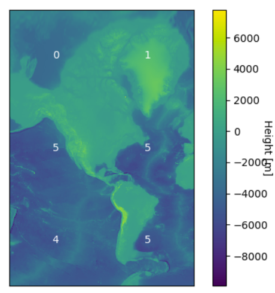

ASEiED - terrain tiles
======================
Goal
----
Determine six types of the area across North and South America with respect to mean height difference.

 

Numenclature assumptions
------------------------
    measurement point = 1 pixel
    localization = 4x4 pixels = 16 measurements points
    area = 512x512 pixels = 128x128 localizations = 262144 measurements points

 

Dependencies
------------
[PySpark](https://spark.apache.org/docs/latest/api/python/index.html)

[Pillow](https://pillow.readthedocs.io/en/stable/)

[Matplotlib](https://matplotlib.org/)

 

Dataset
-------
As a dataset, we used [Terrain Tiles](https://registry.opendata.aws/terrain-tiles/) which provides bare-earth terrain heights.

Tiles can be accessed via a URL pattern

    https://s3.amazonaws.com/elevation-tiles-prod/{format}/{z}/{x}/{y}.png

where

    z – zoom that ranges from 0 to 20
    x – horizontal position, counting from the “left”, ranges from 0 to variable depending on the zoom
    y – vertical position, counting from the to the “top”, ranges from 0 to variable depending zoom

 

Data decoding
-------------
We chose to use a terrarium data format which contains raw elevation in meters, in Web Mercator projection (EPSG:3857) encoded in .png files. All values are positive with 32768 offset, split into red, green and blue channels.

Decoding formula

    height = (red*256 + green + blue/256) – 32768

In order, to maximize the efficiency of data processing, all calculations are made on as big chunks of data as possible. That approach allows Spark to take advantage of its ability to parallelize data processing.

    # merge tiles into area
    k_stop, l_stop = height_of_area // height_of_tile, width_of_area // width_of_tile
    splitted_area = [Image.open(paths[i + k][j + l]) for k, l in itertools.product(range(k_stop), range(l_stop))]
    area = merge_tiles(splitted_area, height_of_area // height_of_tile, width_of_area // width_of_tile)

Decoding is mapping RGB tuple into height, so computations for every pixel can be performed independently which allows splitting computations across workers. Input data is reshaped into an array in such a way that every row of an array is an RGB tuple. Every row is transformed with decoding formula. Another reshaping restores the previous shape of data, which is saved for sake of visualization.

    # decode data
    area_rdd = sc.parallelize(area.reshape((area.size // 3, 3)))
    decoded_area_rdd = area_rdd.map(lambda x : x[0]*256 + x[1] + x[2]/256 - 32768)
    decoded_area = np.array(decoded_area_rdd.collect()).reshape((height_of_area, width_of_area))
    decoded_areas.append(decoded_area)

 

Computation of mean height difference
-------------------------------------
Computation of mean height difference can be decomposed into computation height difference for each localization and computation of mean height difference for an entire area.

Ordinary reshaping doesn't preserve spatial information. To achieve correct form of input data, an area must be split vertically and horizontally and reshaped into localization-per-row shape.

    # convert area to localizations
    vsections = height_of_area // height_of_localization
    hsections = width_of_area // width_of_localization
    localizations = [np.hsplit(row, hsections) for row in np.vsplit(decoded_area, vsections)]
    localizations = np.array(localizations).reshape(
        (decoded_area.size // height_of_localization // width_of_localization,
            height_of_localization*width_of_localization))
    
    # compute mean height difference
    localizations_rdd = sc.parallelize(localizations)
    localizations_rdd = localizations_rdd.map(lambda x : max(x) - min(x))
    height_differences.append(localizations_rdd.mean())

 

Area classification
-------------------
The last step of data processing is classification. The program creates and broadcasts constraints that define the border between groups and maps list of mean height differences into indexes.

    def generate_constraints(data, number_of_groups):
        ''' Generate constraints that will be used for area grouping.
        '''
        min_value, max_value = min(data), max(data)

        constraints = [min_value]
        for i in range(1, number_of_groups):
            constraints.append(i*(max_value - min_value) / number_of_groups + min_value)
        
        constraints.append(max_value)

        return constraints

    def group(x):
        ''' Group area.
        '''
        number_of_groups = len(broadcasted_constraints.value) - 1
        for index_of_group in range(number_of_groups):
            lower_constraint = broadcasted_constraints.value[index_of_group]
            upper_constraint = broadcasted_constraints.value[index_of_group + 1]

            if index_of_group != number_of_groups - 1 and lower_constraint <= x and x < upper_constraint:
                return index_of_group
            
            if index_of_group == number_of_groups - 1 and lower_constraint <= x and x <= upper_constraint:
                return index_of_group
        
        return -1

    # generate groups
    constraints = generate_constraints(height_differences, number_of_groups)
    broadcasted_constraints = sc.broadcast(constraints)
    height_differences_rdd = sc.parallelize(height_differences)
    groups = height_differences_rdd.map(group).collect()

 

Visualization
-------------
Heat map represents height for every measurement point. Numbers show the index of group where area belongs (higher number means higher mean height difference).

 

Conclusion
----------
Classification of spatial data is a task than can be successfully parallelized with MapReduce computation model.